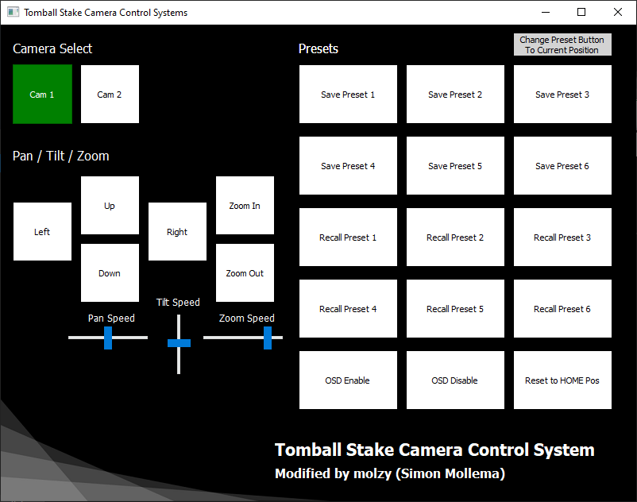

# Camera Controller for Visca Over IP Cameras
This software is a Visca Over IP Camera Controller, built on Python.  The software controls all PTZ functions and allows for presets to quickly move a camera to a predetermined position.  Additionally, the software allows for a USB joystick to be used to control the camera, allowing for an alternative to expensive joystick controller products.



## Visca Over IP
Visca over IP is a protocol defined by Sony to leverage control over their cameras.  The full specification can be found [here](https://www.sony.net/Products/CameraSystem/CA/BRC_X1000_BRC_H800/Technical_Document/C456100121.pdf).

## Requirements
To run the software, you need to make sure you have the following available to you:

### Computer
- A computer with the following:
    - Python 3 (has been tested with Python 3.9) with the following modules installed:
        - PyQT 5
        - pygame (required for joystick control)
            *Note: You can install these modules using pip3.  Consult your python documentation for details.*
    - Game controller (joystick) - *Optional*
    - Camera Control source tree

- Cameras supporting Sony's Visca over IP control protocol

### Config file
The config file for the control software can be found in the conf/app.conf file.  The config file contains a JSON object that describes the configuration for the controller.  The source tree comes with a default example app.conf file that can be used to understand the configurable aspects.

There are 5 major sections of the config file: General, UI, Network, Cameras, and Joystick
#### General
The General section of the config file describes application level configurations.  Currently, there is only a single configuration setting in the general section:
```
    "general": {
        "debug": true
    }
```
- debug - Set this to `true` or `false` to enable or disable debug logging, respectively.  The debug logging will be output to STDIN so capture this output to a file via a pipe when you instantiate the program, if you want to store the data in a log file.

#### UI
The UI section describes configuration items for the View or UI portion of the program.  An example of the UI section is below:
```
"ui" : {
    "backgroundImage": "images/bg.png",
    "fullscreen": false,
    "windowWidth": 800,
    "windowHeight": 480,
    "speeds": {
        "max": {
            "pan":24,
            "tilt":23,
            "zoom":7
        },
        "default": {
            "pan":12,
            "tilt":12,
            "zoom":4
        }
    }
}
```
- backgroundImage - This is the relative path of the background image that you want to use for the UI interface.  This allows you to customize the look and feel of the controller a little bit.
- fullscreen - Set this to `true` or `false`, depending on if you want the UI to be rendered in fullscreen or not.
- windowWidth / windowHeight - Set these to configure the window size of the controller UI.
- speeds - This section describes the defaults and limits that the UI should use for the speeds of PTZ actions.
    - max - This section describes the max speeds for each of the PTZ actions.  The UI will not allow the movements to be faster than this.  *Note: This is defined by the Visca over IP protocol standard, so there shouldn't be any need to change this*
        - pan - The max speed for Pan actions.
        - tilt - The max speed for Tilt actions.
        - zoom - The max speed for Zoom actions.
    - default - This sections describes the default speeds for each of the PTZ actions.  This is useful to set the speeds that will be configured on application startup.  The speeds can always be adjusted using the UI sliders or the joystick.
        - pan - The default speed for Pan actions.
        - tilt - The default speed for Tilt actions.
        - zoom - The default speed for Zoom actions.       

## Use cases
